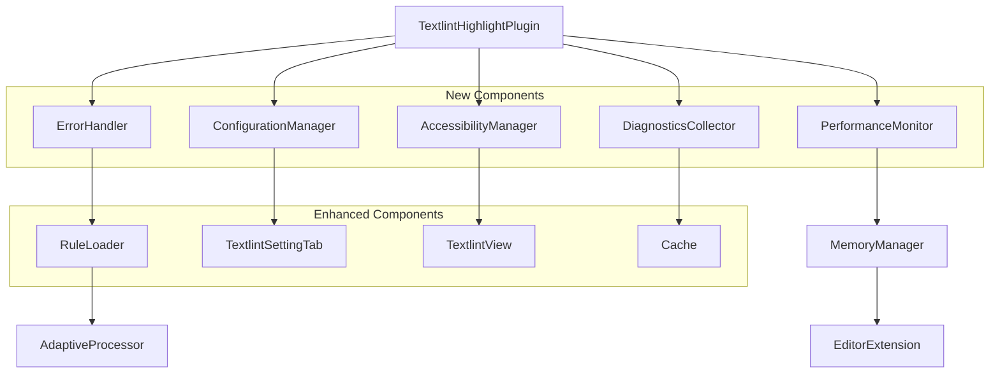

# Design Document

## Overview

This design document outlines the architectural improvements for the Obsidian Textlint Highlighter Plugin to address bugs, enhance performance, and improve user experience. The design builds upon the existing modular architecture while introducing new error handling, monitoring, and user interface components.

## Architecture

### Current Architecture Analysis

The plugin currently uses a well-structured modular architecture:
- **Core Plugin** (`TextlintHighlightPlugin.ts`) - Main orchestration
- **Rule Management** (`RuleLoader.ts`) - Textlint rule loading and caching
- **Editor Integration** (`EditorExtension.ts`) - CodeMirror 6 integration
- **UI Components** (`TextlintView.ts`, `TextlintSettingTab.ts`) - User interface
- **Performance Utilities** (`Cache.ts`, `AdaptiveProcessor.ts`, `MemoryManager.ts`) - Optimization

### Enhanced Architecture

The improved architecture introduces new components while maintaining backward compatibility:



## Components and Interfaces

### 1. Error Handling System

#### ErrorHandler Class
```typescript
interface ErrorContext {
  operation: string;
  file?: string;
  timestamp: number;
  stackTrace?: string;
  userAction?: string;
}

interface ErrorRecoveryStrategy {
  canRecover: boolean;
  fallbackAction: () => Promise<void>;
  userMessage: string;
  retryOptions?: {
    maxRetries: number;
    backoffMs: number;
  };
}

class ErrorHandler {
  handleRuleLoadError(error: Error, ruleId: string): ErrorRecoveryStrategy;
  handleProcessingTimeout(context: ErrorContext): ErrorRecoveryStrategy;
  handleMemoryPressure(stats: MemoryStats): ErrorRecoveryStrategy;
  handleNetworkError(error: Error): ErrorRecoveryStrategy;
  logError(error: Error, context: ErrorContext): void;
}
```

#### Error Recovery Strategies
- **Rule Loading Failures**: Continue with available rules, cache failed attempts
- **Processing Timeouts**: Offer chunked processing or reduced rule sets
- **Memory Issues**: Automatic cache cleanup and processing queue management
- **Network Problems**: Offline mode with cached resources

### 2. Performance Monitoring System

#### PerformanceMonitor Class
```typescript
interface PerformanceMetrics {
  processingTime: number;
  memoryUsage: number;
  cacheHitRatio: number;
  queueLength: number;
  errorRate: number;
}

interface PerformanceThresholds {
  maxProcessingTime: number;
  maxMemoryUsage: number;
  minCacheHitRatio: number;
  maxQueueLength: number;
}

class PerformanceMonitor {
  trackOperation<T>(operation: string, fn: () => Promise<T>): Promise<T>;
  getMetrics(): PerformanceMetrics;
  checkThresholds(): PerformanceAlert[];
  optimizeAutomatically(): Promise<void>;
}
```

#### Automatic Optimizations
- **Cache Strategy Adjustment**: Dynamic TTL and size limits based on usage patterns
- **Processing Queue Management**: Intelligent request batching and prioritization
- **Memory Cleanup**: Proactive garbage collection and cache eviction
- **Rule Set Optimization**: Adaptive rule selection based on file characteristics

### 3. Enhanced User Interface

#### Improved TextlintView
```typescript
interface IssueGroup {
  severity: number;
  count: number;
  issues: TextlintMessage[];
  expanded: boolean;
}

interface ViewState {
  groupBySeverity: boolean;
  showProgress: boolean;
  filterBySeverity: number[];
  sortBy: 'line' | 'severity' | 'rule';
}

class EnhancedTextlintView extends TextlintView {
  renderGroupedIssues(groups: IssueGroup[]): void;
  showProgressIndicator(progress: ProcessingProgress): void;
  renderQualityMetrics(metrics: QualityMetrics): void;
  handleKeyboardNavigation(event: KeyboardEvent): void;
}
```

#### Progress Indication System
```typescript
interface ProcessingProgress {
  currentStep: string;
  completedSteps: number;
  totalSteps: number;
  estimatedTimeRemaining: number;
  processingRate: number;
}

class ProgressIndicator {
  show(progress: ProcessingProgress): void;
  update(progress: ProcessingProgress): void;
  hide(): void;
}
```

### 4. Configuration Management

#### ConfigurationManager Class
```typescript
interface ConfigurationProfile {
  name: string;
  description: string;
  settings: Partial<TextlintPluginSettings>;
  performance: PerformanceProfile;
}

interface PerformanceProfile {
  maxFileSize: number;
  chunkSize: number;
  timeout: number;
  cacheSize: number;
}

class ConfigurationManager {
  validateSettings(settings: TextlintPluginSettings): ValidationResult;
  detectConflicts(settings: TextlintPluginSettings): RuleConflict[];
  exportConfiguration(): ConfigurationExport;
  importConfiguration(config: ConfigurationExport): Promise<void>;
  getRecommendedProfile(fileStats: FileStats): ConfigurationProfile;
}
```

#### Smart Configuration Features
- **Conflict Detection**: Identify incompatible rule combinations
- **Performance Impact Analysis**: Show processing time estimates for rule combinations
- **Profile Recommendations**: Suggest optimal configurations based on usage patterns
- **Migration Assistance**: Help users upgrade configurations between versions

### 5. Accessibility Enhancements

#### AccessibilityManager Class
```typescript
interface AccessibilityOptions {
  screenReaderSupport: boolean;
  highContrastMode: boolean;
  keyboardNavigation: boolean;
  voiceControlSupport: boolean;
  reducedMotion: boolean;
}

class AccessibilityManager {
  applyAriaLabels(element: HTMLElement): void;
  setupKeyboardNavigation(): void;
  adjustForHighContrast(): void;
  announceToScreenReader(message: string): void;
}
```

#### Accessibility Features
- **ARIA Labels**: Comprehensive labeling for all interactive elements
- **Keyboard Navigation**: Full functionality accessible via keyboard
- **Screen Reader Support**: Proper announcements for status changes
- **High Contrast Mode**: Automatic color scheme adjustments
- **Voice Control**: Named elements for voice navigation software

### 6. Diagnostics and Monitoring

#### DiagnosticsCollector Class
```typescript
interface DiagnosticReport {
  timestamp: number;
  version: string;
  environment: EnvironmentInfo;
  performance: PerformanceMetrics;
  errors: ErrorLog[];
  configuration: ConfigurationSnapshot;
  cacheStats: CacheStatistics;
}

class DiagnosticsCollector {
  generateReport(): DiagnosticReport;
  collectEnvironmentInfo(): EnvironmentInfo;
  sanitizeForPrivacy(report: DiagnosticReport): DiagnosticReport;
  exportForSupport(): string;
}
```

## Data Models

### Enhanced Settings Model
```typescript
interface EnhancedTextlintPluginSettings extends TextlintPluginSettings {
  // Performance settings
  maxFileSize: number;
  processingTimeout: number;
  cacheSize: number;
  
  // UI preferences
  groupIssuesBySeverity: boolean;
  showProgressIndicators: boolean;
  enableAnimations: boolean;
  
  // Accessibility settings
  accessibilityMode: boolean;
  highContrastMode: boolean;
  screenReaderSupport: boolean;
  
  // Advanced settings
  enableAutoOptimization: boolean;
  diagnosticsLevel: 'none' | 'basic' | 'detailed';
  errorRecoveryMode: 'automatic' | 'manual';
}
```

### Quality Metrics Model
```typescript
interface QualityMetrics {
  totalIssues: number;
  issuesBySeverity: Record<number, number>;
  mostCommonRules: Array<{ ruleId: string; count: number }>;
  improvementSuggestions: string[];
  qualityScore: number; // 0-100
  comparisonToPrevious?: {
    issuesDelta: number;
    scoreDelta: number;
  };
}
```

## Error Handling

### Error Classification System
```typescript
enum ErrorSeverity {
  LOW = 'low',        // Non-critical, continue operation
  MEDIUM = 'medium',  // Degraded functionality, notify user
  HIGH = 'high',      // Major feature broken, offer alternatives
  CRITICAL = 'critical' // Plugin unusable, require intervention
}

enum ErrorCategory {
  RULE_LOADING = 'rule_loading',
  PROCESSING = 'processing',
  MEMORY = 'memory',
  NETWORK = 'network',
  CONFIGURATION = 'configuration',
  UI = 'ui'
}
```

### Recovery Mechanisms
1. **Graceful Degradation**: Continue with reduced functionality when components fail
2. **Automatic Retry**: Intelligent retry with exponential backoff for transient errors
3. **Fallback Modes**: Alternative processing methods when primary methods fail
4. **User Notification**: Clear, actionable error messages with suggested solutions
5. **Error Reporting**: Optional anonymous error reporting for improvement

## Testing Strategy

### Unit Testing
- **Error Handler**: Test all error scenarios and recovery strategies
- **Performance Monitor**: Verify metrics collection and threshold detection
- **Configuration Manager**: Test validation, conflict detection, and migration
- **Accessibility Manager**: Verify ARIA labels and keyboard navigation

### Integration Testing
- **Plugin Lifecycle**: Test loading, configuration changes, and cleanup
- **Editor Integration**: Verify highlighting synchronization and performance
- **Cache Behavior**: Test cache invalidation and memory management
- **Error Recovery**: Test end-to-end error scenarios and user experience

### Performance Testing
- **Large File Processing**: Test with files of various sizes (1K-100K lines)
- **Memory Usage**: Monitor memory consumption under different workloads
- **Cache Efficiency**: Measure cache hit ratios and optimization effectiveness
- **Concurrent Operations**: Test multiple file processing scenarios

### Accessibility Testing
- **Screen Reader Compatibility**: Test with NVDA, JAWS, and VoiceOver
- **Keyboard Navigation**: Verify all functionality accessible via keyboard
- **High Contrast Mode**: Test visibility in various contrast settings
- **Voice Control**: Test compatibility with Dragon NaturallySpeaking

### User Experience Testing
- **Error Scenarios**: Test user experience during various error conditions
- **Performance Degradation**: Test behavior under resource constraints
- **Configuration Changes**: Test settings migration and validation
- **Progress Feedback**: Verify progress indicators and user communication

## Implementation Phases

### Phase 1: Core Infrastructure (Weeks 1-2)
- Implement ErrorHandler and basic error recovery
- Add PerformanceMonitor with basic metrics
- Enhance existing Cache system with better eviction strategies

### Phase 2: User Interface Improvements (Weeks 3-4)
- Implement grouped issue display in TextlintView
- Add progress indicators for long operations
- Enhance settings UI with validation and conflict detection

### Phase 3: Advanced Features (Weeks 5-6)
- Implement AccessibilityManager and ARIA support
- Add DiagnosticsCollector and reporting features
- Implement automatic performance optimization

### Phase 4: Testing and Polish (Weeks 7-8)
- Comprehensive testing across all components
- Performance optimization and memory leak fixes
- Documentation and user guide updates